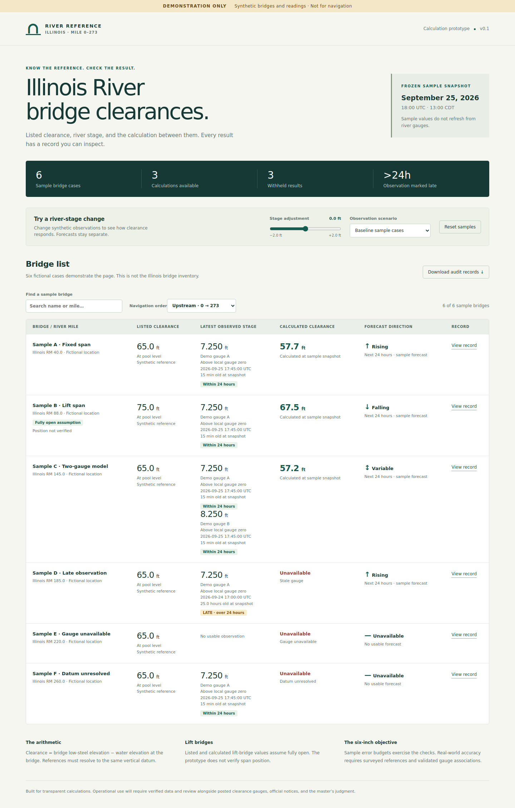

# Illinois River Bridge Clearance Calculator

A **bridge-directory and calculation prototype** for Illinois Waterway miles 0–279. The main page lists source crossings in increasing river-mile order, with search, reverse order, mile-source records and visible pending-data rows. Henry, Morris and EJE have separate live pilot estimates. The Abraham Lincoln bridge now shows a La Salle gauge stage and gauge-only forecast; its clearance stays unavailable pending a NAVD88 bridge reference and water-level tie. EJE converts USACE Dresden NGVD29 tailwater using NOAA CDII2's published −0.21-ft NAVD88 gauge zero; the cross-agency tie, chart edition and survey epoch remain unverified. All three selected chart elevations reconcile exactly. This is not an operational clearance service or a verified physical-bridge inventory. The synthetic calculator is now at `/demo`; the detailed Henry pilot remains at `/henry`.



[Mobile preview](docs/screenshots/prototype-mobile.png)

## Run locally

Install Node.js 22 or newer, open a terminal in this repository, then run:

```sh
npm start
```

Open **http://localhost:3000**. No npm packages, API keys or database are required. The server listens only on the local computer. Stop it with Ctrl+C. The default port can be changed with the `PORT` environment variable.

Open **http://localhost:3000/henry** for the live gauge pilot. It requires internet access and writes auditable source snapshots to `var/henry/` (or `HENRY_DATA_DIR`). Run `npm run henry:refresh` to fetch and inspect a snapshot directly. The [pilot documentation](docs/henry-live-pilot.md) explains the feed contract, forecast rules, storage and remaining reference evidence.

```sh
npm test
npm run check
```

## What to review

The next milestone adds a [real bridge inventory and three-pilot review](docs/pilot-data-review.md), with a [37-row source table](docs/bridge-inventory-table.md), preserved source evidence and unresolved conflicts. These research records now seed the main directory. A separate scope extension adds the I-55 crossing near derived mile 277.9. Unselected research clearance assertions are not accepted calculation inputs. Run `npm run inventory:check` to verify the research package.

At **http://localhost:3000/demo**:

1. Sample A: listed clearance 65.0 ft at a 500.0-ft reference surface. Stage 7.25 ft above a 500.0-ft gauge zero gives water elevation 507.25 ft. Clearance is 57.75 ft, displayed as **57.7 ft** after downward rounding.
2. Raise the stage adjustment by 1.0 ft. Calculated clearance falls by exactly 1.0 ft.
3. Sample B: listed and calculated values both assume the lift span is **fully open**. Its position is not verified.
4. Sample C: two gauges bracket the synthetic bridge. Both normalized water elevations appear in its record.
5. Sample D: a 25-hour-old observation is marked **LATE**, and clearance is withheld under the fixture's separate two-hour stop policy.
6. Samples E/F: missing observations and an unresolved NGVD29 conversion remain visible with unavailable results.
7. Use the scenario menu, upstream/downstream sort, search, expandable records and JSON audit download.

The sample cutoff stays frozen at **2026-09-25 18:00 UTC** so repeat runs can be compared. There is no live refresh, and changing sample stages does not alter the separate synthetic forecast.

## Architecture

| File | Responsibility |
|---|---|
| `illinois-bridge-clearance-model-spec.md` | Overall design, including the confirmed >24-hour late rule |
| `src/exact.js` | BigInt rational arithmetic, exact length conversion, canonical JSON and SHA-256 |
| `src/calculator.js` | Pure calculation, validation, forecast direction and reproducible receipts |
| `data/demo.js` | Six fictional scenarios with hashed source snapshots |
| `src/app.js`, `demo.html`, `styles.css` | Responsive browser interface; no external assets or libraries |
| `server.mjs` | Local static server with an explicit asset allowlist |
| `src/feeds/henry.js`, `src/henry-service.js` | Official stage/forecast parsing, validation, persistent source snapshots and receipts |
| `henry.html`, `src/henry-page.js` | Live Henry pilot estimate with explicit owner assumptions |
| `test/` | Calculation and HTTP tests; optional browser interaction check |
| `docs/implementation.md` | Implemented behavior, limitations and next milestones |

The prototype runs the calculator in the browser. The core has no DOM or network dependency and can move unchanged into a future ingestion/calculation service. Production data must eventually be served from validated, versioned backend snapshots; browsers should not scrape official feeds.

## Audit receipts

Downloaded JSON contains the complete input snapshot, input revision IDs, source payloads and SHA-256 hashes, UTC cutoff, formula version, selected observations and gauge-zero epochs, datum transforms, exact fractional results, display value, error components and forecast receipt. The receipt ID hashes the complete input-and-result body using key-sorted JSON. It is a content identifier, not a signature or proof of source authenticity.

`createReceipt(input)` also verifies included source-payload hashes. `calculate(input)` is the synchronous mathematical core and expects ingestion to verify payload integrity. Neither function reads the clock or fetches data. Replaying the same input with the same formula version produces the same receipt.

All measured values are decimal strings. `ft` means the international foot; `us_survey_ft` is explicitly different. Exact numerators and denominators remain available even when a converted value repeats in decimal notation.

## Deliberate prototype limits

- Production input in the synthetic core is disabled. Henry’s separate pilot adapter permits a labeled estimate using the owner’s direct-water-level assumption; overall accuracy remains unverified. Setting `datasetKind` to anything except `SYNTHETIC` withholds clearance.
- The **six-inch objective is not field-validated**. Sample error allowances only exercise the gate and include elapsed-time and display-rounding contributions. No uncertainty or operating margin is deducted from the clearance.
- Models implemented: direct, fixed offset, bracketed linear. Piecewise ratings, fallback gauge models, other movable-bridge geometries, and unlimited-clearance states are deferred.
- The fixture's two-hour calculation stop, 24-hour forecast window, 0.1-ft forecast deadband and pilot's 18-hour forecast issue limit are demonstration defaults. Only the observation late label **strictly after 24 hours** is owner-confirmed.
- The official-source research inventory is incomplete as a verified physical-structure catalog. Henry has live USGS stage and NOAA station-forecast feeds plus local snapshot persistence. Authentication, external monitoring and deployment are not included.
- River-wide adapters, a production bitemporal database, automated source reconciliation, survey review and hydraulic validation remain to be built.

## Optional browser check

With Playwright installed in your development environment and Chromium available:

```sh
node scripts/browser-check.mjs
```

The script starts its own local server and checks desktop/mobile layouts, stage adjustment, failure scenarios, filtering, sort, records and download. If Playwright is outside the project, set `PLAYWRIGHT_MODULE` to its absolute module entry path. Browser checks are optional developer tooling and not a runtime dependency.


## Mile-ordered main page

`/` serves the directory; `/api/bridges` returns its versioned references and source assertions. `src/directory.js` applies owner-confirmed chart miles first, published historical USCG river miles second, and the provisional Coast Pilot crosswalk last. Differences remain visible; equal miles sort deterministically by bridge ID. Removed spans appear only when selected. Scope is inclusive 0–279. The original 37-row research package remains unchanged; the additional Des Plaines evidence is preserved separately. Current physical completeness, multiple-span grouping and replacement identities remain under review.

Morris: mile 263.5; 50.4-ft clearance at 482.5-ft pool; 532.9-ft low steel, NAVD88. EJE: mile 270.6; fully open clearance 61 ft at 482.5-ft pool, with corrected fully open low steel 543.5 ft NAVD88 confirmed by the owner. Reference revision 5 preserves the original 513.5-ft report as superseded history, identifies the chart as the bridge-elevation source, and identifies [NOAA CDII2 metadata](https://api.water.noaa.gov/nwps/v1/gauges/cdii2) as the −0.21-ft NAVD88 gauge-zero source. Morris uses its published 478.17-ft NAVD88 gauge zero; EJE uses Dresden's absolute NGVD29 tailwater plus the NOAA value in an unverified pilot tie. Both results are labeled pilot estimates at the observation time. See [three bridge pilot](docs/three-bridge-pilot.md).

Optional directory checks: `node scripts/browser-check-directory.mjs` with Playwright/Chromium, or `node scripts/dom-check-directory.mjs` with LinkeDOM (`LINKEDOM_MODULE` may point to an external installation). The DOM check does not test visual layout. Neither is an app runtime dependency.

`npm run pilots:refresh` retrieves and archives all four gauge source records. Forecast direction is only shown for a fresh, complete station forecast; the labeled 24-hour window may begin at the next scheduled forecast point. Abraham Lincoln/LSLI2 is a [stage-only source review](docs/abraham-lincoln-source-review.md); the older Corps NGVD29 navigation chart and a separate NAVD88 hydraulic-model low chord do not establish an approved bridge clearance. The fourth result never computes a numerical clearance.
