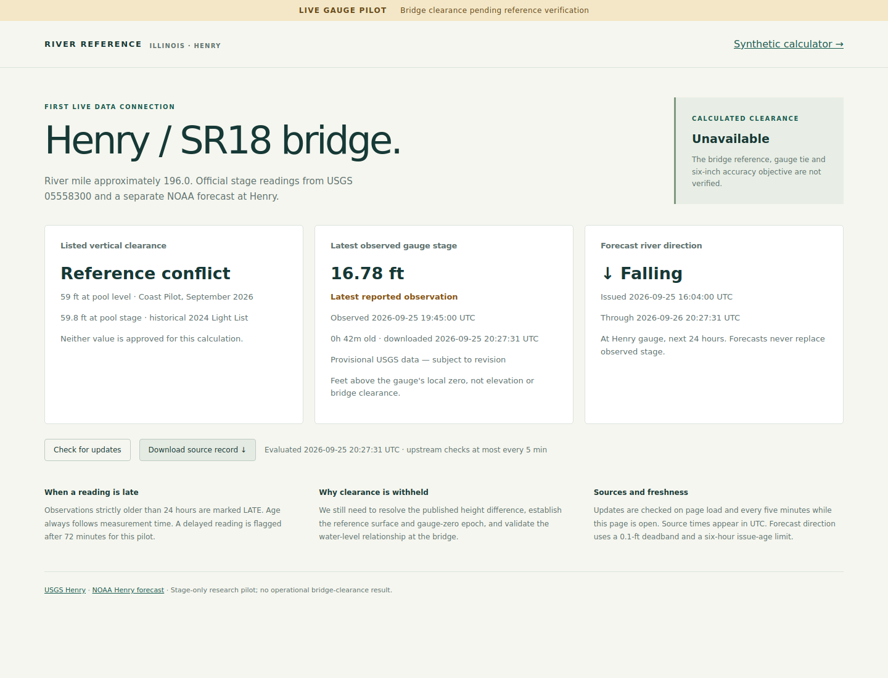

# Henry live gauge pilot

Implemented September 25, 2026. Run `npm start`, then open **http://localhost:3000/henry**. The original synthetic calculator links to this page. Nothing has been deployed or enabled as an operational clearance calculator.

The Henry page displays a real USGS stage observation and separate NOAA forecast direction **at the gauge**. Calculated bridge clearance is an **estimate at observation time**, using the owner-approved direct water-level assumption. The owner has selected the e-chart's 59.8-ft listed clearance, 499.6-ft low-steel elevation and 439.8-ft normal-pool elevation. The page shows that selection and the working assumptions and remaining validation requirements.



[Mobile screenshot](screenshots/henry-mobile.png). Screenshots are historical examples from the first verification run, before the owner's reference selection; they are not current readings or the updated reference card.

## Run and verify

```sh
npm start
npm run henry:refresh
npm run check
```

`henry:refresh` fetches and archives the official sources, prints the stage/forecast status and exits nonzero if stage validation fails. `/api/henry` returns the auditable input and result. “Download source record” saves that exact response. Ordinary tests use archived fixtures and temporary directories; they never depend on network availability.

The default local store is `var/henry/`, excluded from git. Set `HENRY_DATA_DIR` to a persistent directory if running elsewhere. Run only one server/refresh process against a store at a time; in-process requests are coalesced, but distributed locking is not implemented. Server and CLI require Node 22+ and outbound HTTPS to the official APIs. No key is needed for the low-volume pilot's verified requests; rate limits or access failures produce unavailable states.

## Verified feed contract

| Component | Exact source | Validation |
|---|---|---|
| USGS observation | [latest-continuous, Henry, parameter 00065](https://api.waterdata.usgs.gov/ogcapi/v1/collections/latest-continuous/items?f=json&monitoring_location_id=USGS-05558300&parameter_code=00065&limit=100) | One instantaneous stage series, string value in ft, explicit timestamp, approval status and qualifier |
| USGS series metadata | [time-series-metadata](https://api.waterdata.usgs.gov/ogcapi/v1/collections/time-series-metadata/items?f=json&monitoring_location_id=USGS-05558300&parameter_code=00065&limit=100) | Series `2368ad8cb32f4cc4bcd1068c0faab837`, statistic 00011, Primary / Points / Instantaneous; semantic fields pinned |
| NOAA forecast | [HNYI2 forecast stageflow](https://api.water.noaa.gov/nwps/v1/gauges/hnyi2/stageflow/forecast) | HGIFF, Stage, ft, ILX, a single issued/generated run, valid times and full window coverage |
| NOAA station | [HNYI2 metadata](https://api.water.noaa.gov/nwps/v1/gauges/hnyi2) | Crosswalk explicitly identifies USGS 05558300; verifies product identity and the pinned 425.85-ft NAVD88 vertical reference |

[USGS schema](https://api.waterdata.usgs.gov/ogcapi/v1/collections/latest-continuous/schema?f=html) defines string-valued measurements, provisional/approved status, qualifiers and `last_modified`. The latter is a database refresh time, not proof the measurement changed. [NOAA API documentation](https://api.water.noaa.gov/nwps/v1/docs/) describes the gauge and forecast endpoints. The feed contract in `data/henry-feed-contract.json` preserves the reviewed instantaneous-series semantics, public suppression thresholds and data-gap interval. Relevant changes block stage display until reviewed; metadata period-of-record endpoint updates do not.

USGS sends stage as a decimal string. NOAA sends numeric tokens; the JSON reviver captures their original decimal text before arithmetic. Forecast interpolation, differences and deadband comparisons use `Q` exact rational arithmetic. Timestamps use explicit RFC3339 offsets, validated calendar dates and UTC normalization. Raw strings, including sub-millisecond source timestamps, remain in the archived payload; temporal comparisons use milliseconds.

## Freshness, quality and outages

- Upstream fetches occur on demand at most once per five minutes per process. The page refreshes on load, when returning to the tab and every five minutes while visible. This is not an unattended collector when the server/page is unused.
- Observation age is calculated from **measurement time**, never fetch time. The API evaluates age at each request; the page displays its evaluation timestamp. `LATE` is strictly greater than 86,400 seconds. Exactly 24 hours remains not late.
- `DELAYED` is a separate display flag above 72 minutes, taken from the current USGS series data-gap interval `PT1H12M`. It is a pilot display policy, not an approved clearance-eligibility limit or guarantee of normal latency.
- Unqualified Provisional/Approved stage values may display with their source status. Any non-null qualifier, unknown approval state, out-of-range/sentinel value, wrong parameter/unit/series, duplicate latest records, incomplete pagination, invalid/future time or changed semantic metadata withholds the stage.
- The checked agency public-suppression range is −1 to 40 ft for this series. It is not a validated bridge operating envelope.
- Older source observations, older revisions, and different values with the same observation/revision time are blocked across polls. Prior accepted stages remain historical context only, with original observation and receipt times.
- HTTP failures, timeouts, unexpected content type, malformed JSON and responses above 1 MiB cannot become readings. Requests time out after 15 seconds; concurrent requests share one refresh. HTTP error bodies are archived when within the size limit. Oversized/transport-failed downloads retain failure metadata but not a truncated pretend source document.
- An upstream failure does not replace or refresh the age of the last accepted reading. The UI labels it historical and shows the newest attempt's error state. A failure of the local API clears previously displayed stage, forecast and clearance values instead of leaving them looking current.

## Independent forecast direction

Direction applies to **HNYI2 only**, not an approved bridge water model. It compares the forecast at the evaluation time and 24 hours later, using exact linear interpolation within one run and inspecting intermediate values for reversals. No extrapolation, observed-stage substitution or cross-provider subtraction occurs.

Pilot defaults are a ±0.1-ft deadband, issue age no greater than six hours, and no gap over six hours across the required forecast window. These defaults remain reviewable and are not user-confirmed operational policy. Stale/missing forecasts, mixed generated times, duplicates, sentinel values, changed units/products or incomplete coverage return forecast unavailable independently of stage status. Forecasts never enter the current-clearance calculation.

## Audit and storage

Each refresh stores UTF-8 source bodies under SHA-256 content IDs using exclusive writes, plus an immutable snapshot containing URLs, request/receive times, HTTP status, content type, hashes, raw bodies and previous accepted-stage context. An atomic pointer identifies the latest completed refresh. Snapshots link to their predecessor and survive process restart. Stored snapshot and payload hashes are checked before reuse. Disk failures fail the API rather than silently publishing an unrecorded reading.

A downloaded receipt contains the adapter version, full source snapshot, historical context, evaluation time, result and content hash. Re-run `evaluateHenry(receipt.input, receipt.result.asOf)` for the stage/forecast/clearance portion. The separately retained historical display summary has its previous source hash. Content hashes establish integrity, not source authenticity or physical accuracy. The local store is append-only by application convention, not tamper-proof storage; backups, retention, access control and multi-process locking remain future work.

`test/fixtures/henry/` contains archived official responses from September 25. They are test inputs, not a default offline live-data fallback. Test receipt times are deliberately fixed and clearly separate from source observation times.

## Reference verification findings

The new NOAA gauge metadata explicitly lists **425.85 ft NAVD88** under vertical datums and identifies the same USGS site. This is stronger corroboration than the generic USGS land-surface/site-altitude field alone. It still supplies no effective gauge-zero interval, exact foot realization, surveyed bridge reference or validated bridge-water transfer. USACE's 425.88 ft NGVD29 zero remains a separate assertion; no −0.03-ft transformation has been approved or inferred.

On September 25, 2026 Pacific time (September 26 UTC), the owner selected **59.8 ft**, reporting that their e-chart also shows **499.6 ft low steel** and **439.8 ft normal pool**. These assertions and the owner's selection are stored in `data/henry-bridge-reference.json`, with chart product/edition, foot realization and survey date explicitly unknown. The owner subsequently confirmed NAVD88 for these and all owner-supplied chart elevations. No chart image has yet been supplied. This resolves the owner's choice of listed clearance; it does not independently reconcile the agency publications or independently verify the chart metadata. Original source assertions remain in the historical research inventory.

The exact consistency check passes: `499.6 − 439.8 = 59.8 ft`. The production model will use **low-steel elevation minus water elevation at the bridge**, expressed in the same verified datum. Changing the datum of the water alone would be wrong; if conversion is needed, low steel and water must both resolve to the canonical datum. The equivalent reference-clearance formula must give the same result.

Preserve the bridge's reported **439.8-ft** normal pool. Do not replace it with the gauge's separately published 440.0-ft flat-pool sum: doing so would shift an inferred low-steel elevation by **0.2 ft (2.4 inches)**. Different local pool-reference elevations may reflect different locations or definitions and must not be equated without evidence.

## Owner-approved pilot calculation

On September 26, the owner authorized assuming bridge water elevation equals the selected gauge water elevation, with differences within **two inches**. Reference revision 3 records this as `OWNER_ASSUMPTION`, not a measured error bound. Henry alone is enabled; other bridges require an explicit selected gauge and reference record.

Adapter `henry-stage-pilot-4` uses:

```text
water elevation NAVD88 = 425.85 + observed Henry stage
estimated clearance = 499.6 − water elevation = 73.75 − stage
```

The 2-inch allowance is exactly 1/6 ft and is recorded, **not deducted**. Clearance is rounded downward to 0.1 ft for display; the exact result and actual rounding difference remain in the receipt. At normal-pool stage 13.95 ft, the result is exactly 59.8 ft. The archived test observation of 16.78 ft gives water elevation 442.63 ft and exact clearance 56.97 ft, displayed as 56.9 ft; this is a test example, not a current reading.

Each result explicitly identifies its observation time. Above 72 minutes it is labeled `DELAYED — historical estimate`; strictly above 24 hours it is labeled `LATE — historical estimate`. Old observations are never described as current clearance. Source failures withhold the estimate; a last accepted stage can appear only as separate historical context. A missing or stale forecast does not block an otherwise valid observed-stage estimate and never supplies its water elevation.

The adapter verifies source hashes, station crosswalk, observed product identity, exactly one NAVD88 reference matching the pinned 425.85-ft zero, bridge reference arithmetic and the explicit bridge/gauge model. A changed or missing zero/datum, mismatched gauge/model, disabled pilot or rejected observation produces no numeric clearance. No NGVD29 source value is relabeled NAVD88. The complete versioned bridge record and source payloads accompany the replayable receipt.

The pilot assumes the published zero applies to the observation. Its effective epoch and exact foot realization have not been independently verified. Overall accuracy remains `UNVERIFIED`, and production eligibility remains false. The two-inch hydraulic assumption alone does not establish the total six-inch target. Operational validation still needs chart/survey evidence, gauge-zero epoch and unit records, independent bridge/gauge observations across changing conditions, and a reviewed total error allowance below 0.5 ft including age and display rounding.

## Verification

Live requests successfully returned USGS Henry stage and NOAA Henry forecast; the page displayed them with their actual source timestamps and provisional label. Automated checks cover source parsing, exact decimal preservation, 24-hour boundaries, metadata drift, quality flags, future times, source regression, forecast run/coverage rules, raw hash integrity, restart persistence, request coalescing and failure handling. The browser-check script covers desktop and 390-pixel mobile layout, audit download and clearing readings after an API outage. Previous browser verification predates the numeric estimate; the current rerun was blocked by a missing Chromium executable and a failed browser download. Current automated verification passes all 38 tests plus inventory checks, including exact clearance, receipt replay, metadata/model rejection and late historical estimates. No operational accuracy or bridge association is claimed by these software checks.
