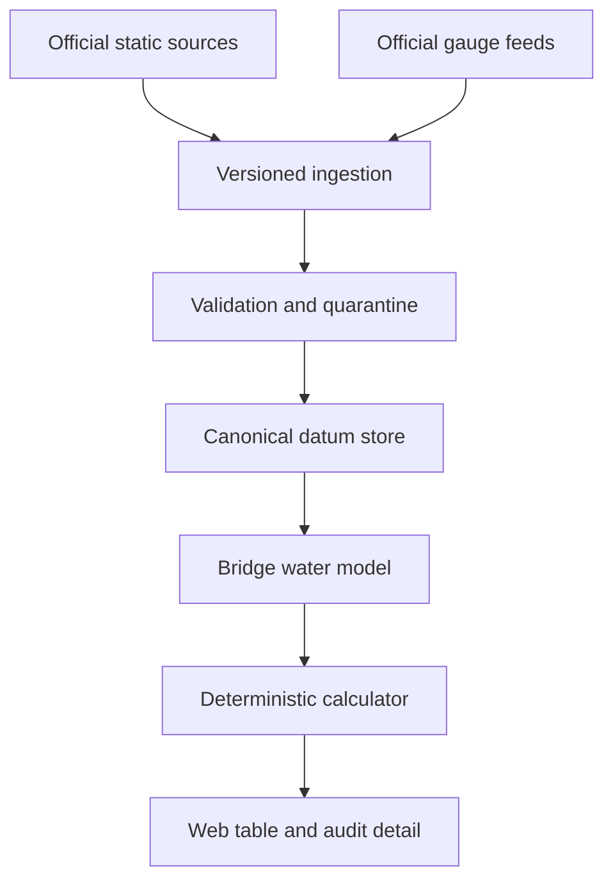

# Illinois River Bridge-Clearance Calculator

## Data and Mathematical Model Specification

**Status:** Initial system design; owner requirements updated September 26, 2026. Observation lateness threshold confirmed as 24 hours.
**Confirmed scope (revised September 26):** Illinois Waterway miles 0–279, from the Mississippi River at Grafton through the Illinois River and into the lower Des Plaines River. This supersedes the earlier 0–273 limit. The Chicago River, Chicago Sanitary and Ship Canal, Cal-Sag Channel and reaches above mile 279 remain excluded. The main page lists bridges in ascending river-mile order by default, with each mile marker visible even when clearance is unavailable.

**Confirmed presentation requirements:** Lift-bridge clearances are calculated for the fully open position. Show simple calculated clearance, without subtracting an uncertainty allowance or operating margin. The desired total clearance error is strictly less than six inches (0.5 ft). Include forecast river direction separately from observed stage and calculated clearance. Mark observations older than 24 hours as `LATE`.

## 1. Design position

The webpage should list every bridge, but it should call the computed value **calculated current clearance**, not **actual clearance**. Unless the bridge has a live, direct clearance sensor or a physical bridge-clearance board is being read in real time, the value is a deterministic estimate based on water-level observations, datum transformations, and a spatial water-surface model.

The system must prefer **no value** over a plausible-looking but unsupported value. A bridge remains listed when its observation, datum chain, or bridge-to-gauge model is unavailable; its result becomes `UNAVAILABLE`, `STALE`, `SOURCE_CONFLICT`, or `DATUM_UNRESOLVED`.

The core rule is:

> Never subtract two numbers until the system proves that they represent compatible vertical quantities at the same location, datum, units, datum epoch, and time basis.

## 2. Authoritative source hierarchy

### 2.1 Static bridge geometry and published clearance

Use the following priority:

1. Current U.S. Coast Guard bridge record, permit, or correction, when available.
2. Current [NOAA U.S. Coast Pilot 6](https://www.nauticalcharts.noaa.gov/publications/coast-pilot/files/cp6/CPB6_WEB.pdf), including its weekly updates. Its Illinois River table gives bridge type, route measure, horizontal clearance, vertical clearance at pool level and high water, and operating notes.
3. [USACE Rock Island District Bridge Clearance Calculator](https://rivergages.mvr.usace.army.mil/bridge_clearance/bridge_clearance.cfm?bid=2) as a validation oracle and comparison source, not as the sole production database.
4. USACE Illinois Waterway navigation charts and Inland ENC data for location, geometry, and cross-checking. The 2013 chart-book clearances must not override a newer Coast Pilot or Coast Guard correction.

The Coast Pilot says its bridge clearances are approved for nautical charting and are mostly supplied by the Coast Guard. NOAA also posts Coast Pilot updates weekly. The USACE calculator states that it combines Coast Guard bridge information with automated USACE stage-gauge readings.

### 2.2 Dynamic water observations

Preferred source order is configured per gauge, not globally:

1. USACE CWMS/rivergages series identified and approved for that station and parameter.
2. USGS instantaneous-values series for the same physical gauge or an independently validated secondary gauge.
3. NOAA National Water Prediction Service observations for the same physical gauge.

Forecast values are never substituted for observations in the current-clearance calculation. Official stage forecasts may supply the separate forecast-direction field described in section 7.1. HTML-page scraping should not be the production interface when a stable official API or machine-readable feed is available.

All real-time observations are treated as provisional. A secondary source is for corroboration or an explicitly approved fallback; it is not automatically averaged with the primary source.

## 3. Scope and linear referencing

The current Coast Pilot’s Illinois River structure table uses miles above the west end of Chicago Lock. The Illinois River navigation convention commonly uses miles above the river mouth. Preserve both:

- `route_measure_system = CP6_FROM_CHICAGO_LOCK`
- `route_measure_system = IL_RM_ABOVE_MOUTH`

For the current Coast Pilot table, a first-pass crosswalk is:

\[
r_{IL} = 327.2 - r_{CP6}
\]

This derived mile is only a reconciliation aid. Production bridge records must also be checked against USACE river miles and coordinates. Each measurement keeps its source and precision; do not replace an original mile with the derived value.

The current Coast Pilot table on pages 390–391 should seed the inventory. It includes crossings below Beardstown that are not returned by the Rock Island bridge calculator. Removed or replaced spans stay in the historical catalog with effective dates; they are not silently deleted.

## 4. Vertical-reference taxonomy

Do not store every vertical reference in a single `datum_name` text field. Use three different concepts.

### 4.1 Geodetic or tidal datum

Examples: `NAVD88`, `NGVD29`, `IGLD85`, `MSL`, `MLLW`, `LAT`.

These are coordinate reference surfaces. Every value requires:

- datum code and realization/epoch when applicable;
- units;
- location;
- transformation method and version;
- uncertainty or accuracy class;
- effective dates and source.

NGVD29-to-NAVD88 differences are location dependent. A single Illinois-wide offset is prohibited. Tidal-datum conversion is also location and epoch dependent and must use a documented NOAA transformation or a surveyed local tie.

### 4.2 Gauge zero

Gauge zero is a local origin, not a universal vertical datum. Store it as an epoch-specific elevation in a named datum:

\[
Z_{g,D,e}=\text{elevation of gauge zero for gauge }g\text{ in datum }D\text{ during epoch }e
\]

A gauge can change zero, instrumentation, location, or reporting convention. Every observation must resolve to the gauge-datum epoch in force at its observation time.

### 4.3 Reference water surface

Examples: `LWRP`, `LOW_WATER_DATUM`, `NORMAL_POOL`, `FLAT_POOL`, `POOL_LEVEL`, and `HIGH_WATER`.

These are water-surface references or profiles, not geodetic datums. They may vary by river mile and hydraulic reach. Store each as one of:

- a surveyed elevation at a point;
- a piecewise-linear profile by river mile;
- a reference stage on a named gauge and gauge-datum epoch;
- a versioned hydraulic surface.

The Illinois River Coast Pilot table explicitly supplies clearances at **pool level** and **high water**. Those labels must remain intact; neither may be silently renamed LWRP.

## 5. Canonical mathematical model

**Owner confirmation (September 26, 2026 UTC):** All owner-supplied chart elevations use NAVD88. Use NAVD88 for normalized bridge and water elevations throughout the Illinois River app. Preserve external sources' original datum labels; convert other datums only through documented, scoped transformations. This confirmation does not establish gauge-zero epochs, hydraulic equivalence or field accuracy.

Use `NAVD88` as the phase-1 canonical internal datum when a valid transformation is available. The model remains datum-agnostic: another canonical datum can be introduced by versioning the datum graph and formula version.

Use exact decimal arithmetic or integer millimetres internally. Never use binary floating point for final clearance calculations.

### 5.1 Convert gauge stage to water-surface elevation

For a stage observation \(h_g(t)\) relative to gauge zero:

\[
W_g^C(t)=h_g(t)+Z_{g,D,e}+T_{D\rightarrow C}(x_g,y_g,e)
\]

where:

- \(C\) is the canonical datum;
- \(D\) is the datum in which gauge zero is defined;
- \(e\) is the applicable gauge/datum epoch;
- \(T\) is a location- and version-specific vertical transformation.

If the feed already reports an absolute water-surface elevation, do not add gauge zero. Its parameter type must explicitly be `WATER_SURFACE_ELEVATION` rather than `STAGE_ABOVE_GAUGE_ZERO`.

### 5.2 Estimate water elevation at the bridge

For bridge \(b\), an approved and versioned bridge-water model \(F_m\) produces:

\[
W_b^C(t)=F_m\left(W_{g_1}^C(t),\ldots,W_{g_n}^C(t),q(t),R(t)\right)
\]

where \(q\) is optional flow and \(R\) is the hydraulic regime, such as fixed-pool or open-pass operation.

Allowed phase-1 model types are:

1. **DIRECT:** a gauge at the bridge or a demonstrated hydraulically equivalent location.
   \[
   W_b=W_g
   \]
2. **FIXED_OFFSET:** a surveyed or calibrated elevation offset within one hydraulic reach.
   \[
   W_b=W_g+\delta_{bg}
   \]
3. **BRACKETED_LINEAR:** interpolation between upstream and downstream elevation gauges in the same uninterrupted hydraulic reach.
   \[
   W_b=W_d+\lambda(W_u-W_d),\qquad
   \lambda=\frac{r_b-r_d}{r_u-r_d}
   \]
4. **PIECEWISE_RATING:** a calibrated monotone piecewise-linear function based on concurrent observations or an approved hydraulic model.
5. **UNSUPPORTED:** no clearance result is produced.

No runtime extrapolation is allowed outside the model’s validated elevation and hydraulic-regime range.

### 5.3 Convert published clearance into low-steel elevation

For published clearance \(C_{b,ref}\) above a reference water surface \(W_{b,ref}^C\):

\[
S_b^C=W_{b,ref}^C+C_{b,ref}
\]

where \(S_b^C\) is the controlling low-steel elevation for the applicable navigation opening and bridge position.

For a vertical-lift bridge, store separate `CLOSED` and `FULLY_OPEN` low-steel elevations, but select `FULLY_OPEN` for both the main listed-clearance and calculated-clearance columns. A closed-position published clearance must not be displayed as a fully open clearance. If only closed clearance plus lift travel is published, derive the fully open value only when the source confirms compatible opening geometry, reference surface, and full travel; retain both inputs and the derivation. If open geometry is unresolved, withhold the open-position result.

Label each lift-bridge result `Fully open assumption—position not verified` unless an approved current position source confirms otherwise. This is a clearance scenario, not confirmation that the span is raised or available to open. An authoritative restriction on full opening blocks the normal fully open result and receives a visible restriction notice. A swing or bascule bridge that opens to no vertical obstruction returns `UNLIMITED_BY_BRIDGE`, not an arbitrary large number; do not infer this merely from bridge type.

### 5.4 Calculate current clearance

\[
C_b(t)=S_b^C-W_b^C(t)
\]

Equivalent form:

\[
C_b(t)=C_{b,ref}-\left(W_b^C(t)-W_{b,ref}^C\right)
\]

If the published clearance was paired with a reference stage on the same gauge and the same gauge-zero epoch, datum conversion cancels:

\[
C_b(t)=C_{b,ref}-\left(h_g(t)-h_{g,ref}\right)
\]

This shortcut is valid only when the bridge-water model explicitly establishes that equivalence. Matching two values that both say “feet” is insufficient.

### 5.5 Error target and simple display value

Store component bounds:

- bridge-reference uncertainty;
- gauge sensor uncertainty;
- gauge-zero uncertainty;
- datum-transformation uncertainty;
- bridge-water-model uncertainty;
- water-level change since observation and any multi-gauge time mismatch;
- numerical conversion and final display-rounding error.

The desired total absolute clearance error is **strictly less than six inches (0.5 ft / 0.1524 m)**. This is an end-to-end target, not six inches for each component and not merely a target for mean error or RMSE. For reviewed absolute component bounds, apply a conservative internal error budget:

\[
U_{total}=\sum_i u_i < 0.5\text{ ft}
\]

Use this budget to qualify a calculation, **not** to reduce the displayed clearance. The webpage shows the simple result \(C_b=S_b-W_b\), without a lower-bound column and without subtracting an uncertainty allowance or operating margin. Preserve error components and validation evidence in the audit detail. Vessel air draft and operating margin belong in a later passage-assessment feature.

Record the evidence type for each error allowance: reviewed engineering bound, statistical interval with stated coverage, or unknown. Statistical intervals and finite back-tests must not be represented as guaranteed absolute bounds. The six-inch objective remains unverified until source precision, surveys, and independent validation support it. A source stated only to whole feet may already consume the target through rounding alone; adding decimal places does not improve its accuracy.

For the recommended production acceptance gate, withhold a current-clearance number when the total error allowance is unknown or reaches 0.5 ft; show `ACCURACY_UNVERIFIED` or `ACCURACY_LIMIT_EXCEEDED` and retain the bridge row. Meeting the numerical gate is not a guarantee of real-world error. Its confidence/coverage and operating envelope must be approved during validation.

Calculate to at least 0.001 ft internally. Display clearance by rounding downward to 0.1 ft; this formatting is not a safety margin, and its downward difference of less than 0.1 ft counts toward the total error budget. Show listed clearance at its published precision and record the unrounded calculated result in the audit record.

## 6. Bridge-to-gauge association

Gauge selection must be a curated engineering relationship, not a nearest-point lookup.

### 6.1 Hard eligibility rules

A candidate gauge is rejected when any of these is true:

- it is across a lock, dam, controlling works, or unresolved hydraulic boundary;
- it is separated by a major tributary whose effect is not represented;
- its vertical-reference chain is incomplete;
- its parameter is not a compatible stage or water-surface elevation;
- its timestamp, expected interval, ownership, or datum epoch is unknown;
- the bridge location is outside the model’s calibrated elevation or river-mile range.

Along-channel distance is used, not straight-line distance.

### 6.2 Selection order

1. Direct bridge gauge or physical clearance gauge.
2. Same-pool gauge with surveyed/calibrated offset.
3. Two bracketing elevation gauges within the same hydraulic reach.
4. Calibrated piecewise rating or hydraulic-model output.
5. Unsupported: list the bridge but withhold current clearance.

### 6.3 Illinois River hydraulic regimes

At minimum, define reach boundaries at Dresden Island, Marseilles, Starved Rock, Peoria, and LaGrange locks and dams, plus material tributary/backwater boundaries. Peoria and LaGrange require explicit fixed-pool versus open-pass handling. The lower Illinois can be affected by Mississippi River backwater, so it must not inherit a simple upstream “same pool” assumption.

Every `bridge_water_model` contains:

- bridge and reach IDs;
- primary and approved fallback gauges;
- formula type and parameters;
- datum-transform revision IDs;
- valid water-elevation range;
- valid hydraulic regimes;
- calibration interval and sample count;
- bias, RMSE, 95th-percentile absolute error, maximum observed error, and the reviewed contribution to the under-six-inch total error budget;
- reviewer, approval time, and model version;
- effective start/end dates.

### 6.4 Validation before activation

Calibrate and test on different periods. Include low water, normal pool, high water, rapid rises/falls, and open-pass conditions. Compare predictions with at least one of:

- a direct gauge or clearance board reading;
- a surveyed water-surface profile;
- approved hydraulic-model results;
- archived USACE calculator snapshots as an independent comparison.

Do not activate a model solely because correlation is high; constant bias can preserve correlation while producing unsafe clearance. Error metrics and residuals must be evaluated in feet of elevation.

## 7. Observation freshness and availability

Freshness is evaluated from `observed_at`, not from download time. Store `received_at` separately so ingestion delay remains visible.

**Confirmed late-label rule:** Set `late_after_seconds = 86400`. An observation is `LATE` when `as_of_utc - observed_at > 86400 seconds`; exactly 24 hours old is not yet late. Compare UTC timestamps, not calendar dates or download times. This request concerns observation age; it does not automatically set an age limit for bridge surveys or source publications.

Keep the display's lateness label separate from calculation eligibility. An observation can be younger than 24 hours and still fail the six-inch accuracy target because the river is changing. A forecast arrow does not make an old stage current. If a numeric result is retained for historical context, label it `Clearance at observation time`, with the actual time, rather than current clearance.

Each gauge has explicit policy fields:

- `expected_interval_seconds`
- `expected_latency_seconds`
- `late_after_seconds` (confirmed owner threshold: 86400)
- `warn_after_seconds`
- `stop_after_seconds`
- `rapid_change_threshold_ft_per_hour`
- `max_clock_skew_seconds`

The original cadence-based defaults below remain **unapproved technical stop/warning proposals**, separate from the confirmed 24-hour late-label threshold. Validate these limits per gauge before approval; do not assume that the late-label threshold authorizes using data for that long. A calculation may be stopped before its observation becomes `LATE`:

\[
warn=\min(\max(2I+L,30\text{ min}),90\text{ min})
\]

\[
stop=\min(\max(4I+L,60\text{ min}),180\text{ min})
\]

where \(I\) is the configured reporting interval and \(L\) is normal source latency. During a configured rapid-change condition, shorten the stop threshold; do not lengthen it.

States:

| State | Behavior |
|---|---|
| `FRESH` | Calculate and display only if datum, model, and total error gates also pass. |
| `LATE` | Observation age is strictly greater than 24 hours; show exact time and age. A numeric current clearance also requires the independent accuracy and availability gates. |
| `STALE` | No calculated current-clearance value. Show last accepted stage and age as historical context only. |
| `MISSING` | Try only an explicitly approved fallback. Otherwise withhold. |
| `SOURCE_CONFLICT` | Withhold until the conflict clears or is reviewed. |
| `OUT_OF_RANGE` | Withhold; never extrapolate. |
| `ACCURACY_UNVERIFIED` | Withhold current clearance because the total error allowance or its validation is unknown. |
| `ACCURACY_LIMIT_EXCEEDED` | Withhold current clearance because the reviewed total error allowance is at least 0.5 ft. |

Store `observation_freshness` and `calculation_status` separately, allowing combinations such as `LATE` plus `ACCURACY_LIMIT_EXCEEDED` without hiding either condition.

Fallback rules:

- A secondary feed for the same physical sensor may be used when its identity and datum equivalence are proven.
- A different gauge may be used only through a separately approved fallback model.
- A one-sided interpolation is not silently substituted for a two-gauge model.
- A forecast is never labeled as an observation.
- The last good value is never relabeled “current.”

### 7.1 Forecast river direction

Add a separate `Forecast direction` field showing `RISING`, `FALLING`, `STEADY`, `VARIABLE`, or `UNAVAILABLE`. Label it as a forecast at the named gauge; do not describe recent observed movement as a forecast.

Proposed initial direction window: **the next 24 hours**. This forecast horizon is a separate, still-proposed setting; confirmation of the observation-lateness threshold does not approve it. Use the latest accepted official forecast run issued at or before the page cutoff. Compare forecast stage at the cutoff with forecast stage 24 hours later, using linear interpolation only between valid points within the same run. Both endpoints must be covered; never extrapolate, join different forecast runs, or substitute observed stage for a missing forecast endpoint.

Let \(\Delta_f=h_f(t+24h)-h_f(t)\). A proposed versioned deadband is 0.1 ft: `RISING` when \(\Delta_f>0.1\) ft, `FALLING` when \(\Delta_f<-0.1\) ft, and `STEADY` otherwise. If the path contains both a rise and a fall larger than the deadband, show `VARIABLE` with the net change so a crest or trough is not hidden by one arrow. Evaluate the piecewise-linear path, including the exact endpoints, deterministically.

Show forecast issue time, valid window, gauge, and source in the row detail. Forecast freshness has its own approved `max_issue_age_seconds`; stale, missing, invalid, or insufficient-coverage forecasts produce `UNAVAILABLE`, without suppressing an otherwise valid observed clearance. A fresh forecast cannot rescue an invalid current-clearance calculation.

The forecast station must have an explicitly reviewed association with the bridge's hydraulic reach. If a bridge uses multiple observation gauges, use an approved representative forecast gauge or show the separate forecast directions; do not silently pick the nearest forecast. Displaying gauge forecast direction does not imply that a bridge-specific future clearance has been calculated.

## 8. Relational data model

Use bitemporal/versioned records for datum definitions, bridge clearances, gauge epochs, and bridge-water models. `valid_from/valid_to` describes when a fact applied in the world; `recorded_at/superseded_at` describes when the system knew it.

| Table | Important fields |
|---|---|
| `source_artifact` | source ID, agency, URL, document/API version, page/table, effective date, retrieved time, SHA-256, parser version |
| `waterway` | ID, name, extent, canonical mile system |
| `route_measure` | feature ID, mile-system code, value, precision, source ID |
| `hydraulic_reach` | reach ID, upstream/downstream limits, controls, tributary boundaries, regime rules |
| `bridge` | stable UUID, agency IDs, canonical name, aliases, coordinates, status, effective dates |
| `bridge_opening` | bridge ID, opening/span ID, type, operating position, clear width, navigation-channel zone |
| `clearance_reference` | opening ID, published clearance, reference-surface ID, bridge-position state, source ID, precision, validity |
| `vertical_datum` | datum code, family, realization/epoch, units |
| `datum_transform` | from/to datum, spatial scope, method/version, offset or grid reference, uncertainty, source, validity |
| `reference_surface` | type, reach, point/profile/rating representation, datum, values, source, validity |
| `gauge` | stable UUID, agency IDs, location, river mile, reach, owner, timezone, observation policy |
| `gauge_datum_epoch` | gauge ID, valid interval, zero elevation, datum, source, uncertainty |
| `raw_observation` | immutable payload ID/hash, provider, station/series ID, parameter, raw value/unit, qualifier, observed/received times |
| `accepted_observation` | raw ID, normalized value/unit, datum epoch, validation status, rejection reasons |
| `forecast_run` | immutable source payload/hash, provider, forecast gauge/series ID, issued_at, received_at, units, datum/epoch, quality, valid-time coverage, revision |
| `forecast_point` | forecast-run ID, valid_at, forecast stage, units, quality flag |
| `bridge_forecast_association` | bridge ID, approved forecast gauge(s), reach applicability, rationale, valid interval, revision |
| `forecast_direction` | bridge ID, run ID, as-of time, horizon, deadband, endpoint values, net change, direction, issue age, policy version, status |
| `bridge_water_model` | bridge/opening, model type, gauges, parameters, regime, valid range, validation statistics, version |
| `calculation_run` | bridge/opening, fully-open scenario where applicable, as-of time, formula version, all input revision IDs, unrounded outputs, total error allowance and evidence type, observation freshness, calculation status and flags |
| `validation_issue` | entity, rule, severity, evidence, opened/resolved times, reviewer |

Names are not keys. Bridge and gauge aliases change; stable internal IDs and agency IDs provide identity.

## 9. Source-data validation

### 9.1 Static catalog checks

- Current Coast Pilot extraction reconciles to every active/inactive table row and note.
- Duplicate bridge identities are resolved across name changes and replacement spans.
- Coordinates and river miles agree within documented tolerance; discrepancies are quarantined.
- Bridge type, closed/open state, horizontal opening, and clearance reference are populated independently.
- `low_steel = reference_surface + published_clearance` is arithmetically consistent.
- Pool-level and high-water published clearances reconcile to the difference between those reference surfaces.
- Every datum transformation round-trips within its stated tolerance.
- New weekly Coast Pilot hash triggers a semantic comparison and manual approval for changed bridge facts.
- A newer Coast Guard/Coast Pilot correction supersedes older USACE chart data with an explicit conflict record.

### 9.2 Observation checks

- Successful response and schema validation.
- Exact station/series/parameter/units match; no “first numeric field” parsing.
- Timestamp is present, UTC-normalized, not implausibly future-dated, and tied to the expected timezone convention.
- Qualifier/quality code is allowed.
- Value is inside the station’s plausible physical range; negative local stage is allowed when legitimate.
- Rate of change is inside a station-specific envelope or is quarantined for corroboration.
- Duplicate timestamps and revisions follow a deterministic precedence rule.
- Adjacent-gauge hydraulic checks and redundant-source checks run after datum normalization.
- A schema, unit, series-name, datum, or gauge-zero change creates a blocking metadata alert.

Do not average conflicting sources. If normalized observations differ beyond a configured tolerance, mark `SOURCE_CONFLICT`, retain both raw records, and withhold the clearance.

### 9.3 Quality severities

- `BLOCKING` for current clearance: datum unresolved, stale/missing data, incompatible parameter, source conflict, extrapolation, unapproved bridge model, unresolved fully open geometry, full-opening restriction, unknown total error allowance, or total error allowance at least 0.5 ft.
- `WARNING`: late observation still within policy, fallback source used, elevated uncertainty, fast-changing water.
- `INFO`: source revision, alias change, non-controlling metadata difference.

## 10. Determinism and auditability

Each displayed result must be reproducible from an immutable receipt containing:

- calculation ID and `as_of_utc`;
- formula/model version;
- bridge, opening, and published-clearance revision IDs;
- raw and accepted observation IDs;
- observation time, source, parameter, qualifier, and gauge-datum epoch;
- every datum-transform and reference-surface revision;
- hydraulic regime and bridge-water model parameters;
- bridge-position scenario (`FULLY_OPEN` for lift bridges), position verification status, and any applicable restrictions;
- unrounded water elevation, clearance, uncertainty components, and rounded display value;
- total error allowance, evidence type/coverage, and accuracy-gate decision;
- linked forecast receipt: forecast run, issued/valid times, gauge association, horizon, deadband, substituted endpoint values, direction policy version, and result;
- validation flags;
- source payload/document hashes.

The calculation service uses the latest accepted observations at or before a single page-level cutoff time. This prevents different bridge rows from silently representing different page refresh moments.

Reprocessing an old `as_of_utc` with the same immutable inputs and software version must produce the same result byte for byte. Corrections create a new result and preserve the old one.

## 11. Webpage contract

Default table columns:

| Column | Meaning |
|---|---|
| Bridge | Canonical name, type, Illinois River mile |
| Listed vertical clearance | Published value and reference, e.g. `65 ft at pool level`; fully open for lift bridges, with any derivation identified |
| Latest observed river stage | Public-facing gauge value, gauge name, datum label, observation time, age, and late label when applicable |
| Calculated current clearance | Simple calculated value rounded down for display, or a reasoned unavailable status; fully open scenario for lift bridges |
| Forecast direction | Predicted rise/fall/steady/variable over the stated window at the named approved gauge, or unavailable |
| Status | Freshness/source/model state |

Each row expands to show source documents, gauge association, calculation equation with substituted values, open/closed span data, uncertainty, and audit ID.

Required page behaviors:

- Sort in navigation order and allow reversing direction.
- Put observation age next to the stage, not in a distant footer.
- Never render stale data in the same visual style as fresh data.
- Show `Unavailable—stale gauge`, `Unavailable—datum unresolved`, etc., rather than `N/A` alone.
- Keep listed clearance visible even when the calculated value is withheld.
- Show bridge position for movable spans; do not imply that the system knows the live span position unless it has an approved source.
- Label lift bridges `Fully open assumption—position not verified` unless a current approved source confirms the position. Main-row listed and calculated clearances must refer to the same fully open scenario.
- Show only simple calculated clearance in the main view; keep uncertainty in expandable audit detail, without a conservative lower-bound column or margin deduction.
- Forecast arrows must have text labels, a stated forecast window, and a source/issue time available in detail. No forecast is preferable to a guessed arrow.
- Include a conspicuous advisory that the tool supplements, not replaces, posted clearance gauges, Coast Guard/USACE notices, local knowledge, and the master’s judgment.

## 12. Processing architecture

Run static-source checks at least weekly and on manual notice. Poll gauge feeds at a cadence faster than their expected publication interval without overloading the source. Store raw payloads before normalization.

## 13. Test plan

### Unit and property tests

- Increasing water elevation by 1.00 ft decreases clearance by exactly 1.00 ft for direct and fixed-offset models.
- Datum-transform round trips remain within the stated tolerance.
- Gauge-zero epoch selection is correct on the exact change boundary.
- Unit conversions and conservative rounding are exact.
- Missing, late, stale, conflicting, future-dated, revised, and out-of-range observations yield the required status.
- Movable-bridge open/closed calculations select the correct low-steel record.
- Every lift-bridge main row selects `FULLY_OPEN` for both listed and calculated values; missing open geometry cannot fall back to closed clearance.
- Total error allowance of 0.499 ft passes the numeric accuracy gate; 0.500 ft or unknown fails it. All other validation gates remain required.
- Display rounding and time-age error are included in the total error budget; no uncertainty or operating margin is subtracted from the simple calculation.
- Test observation ages of 86,399, 86,400, and 86,401 seconds: only the last is `LATE`. The stated `older than` rule uses a strict greater-than comparison. Verify that a refreshed download cannot reset observation age and that calculation eligibility is checked independently.
- Forecast-direction tests cover rise, fall, deadband boundaries, intervening crest/trough, stale issue time, missing horizon, different runs, and datum mismatch. Forecast availability never overrides current-clearance validation.

### Golden tests

Maintain dated fixtures for representative bridges in each hydraulic reach and each model type. Save the complete official source payloads and expected audit receipts. Compare selected results with archived USACE calculator outputs, but investigate rather than automatically copying discrepancies.

### Hydraulic validation

Back-test bridge-water models against independent observations over low, normal, high, rising, falling, fixed-pool, open-pass, and backwater conditions. Review maximum error, not only average error. Any bridge without a validated model remains listed but does not receive a current-clearance number.

## 14. Recommended implementation sequence

1. **Apply confirmed phase-1 scope.** Illinois Waterway miles 0–279, fully open lift bridges, simple calculated clearance, forecast direction, observations older than 24 hours marked late, and an under-six-inch total error target. Finalize calculation-eligibility age rules separately; resolve whether locks/dam service bridges count as “bridges.”
2. **Build and review the bridge catalog.** Extract the current Coast Pilot table, reconcile USACE IDs/names/miles, and preserve aliases and inactive spans.
3. **Build the datum registry.** Load gauge-zero epochs, pool/high-water/LWRP reference surfaces, and documented transformations.
4. **Inventory gauges and hydraulic reaches.** Assign candidate primary/fallback series and expected freshness policies.
5. **Validate one bridge per reach.** Implement direct/offset/bracketed models, audit receipts, and failure states before expanding coverage.
6. **Expand bridge coverage.** A bridge becomes numeric only after model approval; all bridges can appear from day one.
7. **Add source-change monitoring.** Weekly Coast Pilot semantic diff, gauge metadata drift alerts, and observation freshness monitoring.
8. **Operational review.** Have an Illinois River pilot, survey/datum specialist, and hydraulic engineer review reference surfaces, bridge openings, and error bounds before calling the site production-ready.

## 15. Confirmed requirements and remaining decisions

Confirmed by the owner on September 25, 2026:

1. Initially 0–273; revised September 26 to Illinois Waterway miles **0–279**, including the lower Des Plaines reach.
2. Lift-bridge listed and calculated clearances use the **fully open** position.
3. Desired total clearance error is **under six inches**, subject to demonstrated data/model capability.
4. Include **forecast river direction**, separately from observed stage.
5. Show **simple calculated clearance**, without an uncertainty or operating-margin deduction.
6. Mark observations **older than 24 hours** as `LATE`, measured from observation time, not download time.

Pending clarification or validation:

- The next-24-hours forecast window and 0.1-ft direction deadband are proposed implementation defaults, not owner-specified values.
- The six-inch target requires reviewed uncertainty evidence and a documented coverage level/operating envelope; it cannot be promised from unvalidated source data.
- Finalize calculation-stop/accuracy-age rules separately from the late label. A late label alone does not establish whether a historical number should remain visible.

## References

- [NOAA United States Coast Pilot](https://nauticalcharts.noaa.gov/publications/coast-pilot/index.html)
- [Current U.S. Coast Pilot 6 PDF](https://www.nauticalcharts.noaa.gov/publications/coast-pilot/files/cp6/CPB6_WEB.pdf)
- [USACE Rock Island Bridge Clearance Calculator](https://rivergages.mvr.usace.army.mil/bridge_clearance/bridge_clearance.cfm?bid=2)
- [USACE Bridge Calculator Disclaimer](https://rivergages.mvr.usace.army.mil/bridge_clearance/disclaimer.cfm)
- [USACE CWMS Data API](https://cwms-data.usace.army.mil/cwms-data/)
- [NOAA National Water Prediction Service APIs](https://water.noaa.gov/about/api)
- [USGS Instantaneous Values Service](https://waterservices.usgs.gov/docs/instantaneous-values/instantaneous-values-details/)
- [USGS Policy on Accurate Geodetic Vertical Datum Establishment and Conversion](https://water.usgs.gov/water-resources/memos/memo.php?id=4447)

## Owner-approved pilot assumption — September 26, 2026

For the initial pilot, the owner accepts equal bridge/gauge water elevation with an assumed difference within two inches (exactly 1/6 ft). Record this per selected bridge/gauge model as an owner assumption, not a field-validated bound, and deduct no allowance from simple calculated clearance. This does not authorize automatic nearest-gauge assignment across locks or hydraulic reaches.

Henry uses low steel 499.6 ft NAVD88 and the published HNYI2 gauge zero 425.85 ft NAVD88: estimated clearance = 73.75 ft − observed stage. The pilot explicitly assumes this zero applies to the observation while effective-epoch and foot-realization verification remain pending. Display the result as an estimate at observation time with overall accuracy unverified; retain exact arithmetic, metadata checks, strict >24-hour lateness, forecast separation and full receipts. Delayed/late results must be historical, not current. Missing or invalid inputs withhold the estimate. This pilot exception does not change the validated production acceptance gate or demonstrate the overall six-inch target.

## Pilot source update — September 26, 2026

Morris/MORI2 uses USGS 05542500 instantaneous stage, NOAA’s published 478.17-ft NAVD88 zero and owner-selected 532.9-ft low steel NAVD88. Its assumption-labeled pilot formula is `532.9 − (478.17 + observed stage)`, with the 2-inch transfer assumption recorded but not deducted. Dresden/IL04 tailwater is an absolute NGVD29 elevation. EJE’s fully open low steel is 543.5 ft NAVD88. On September 27, 2026, the owner reported a chart correction of −0.21 ft **from NGVD29 to NAVD88** for EJE, confirming the direction. The versioned pilot formula is `543.5 − (Dresden tailwater NGVD29 − 0.21)`, with the source datum, age, chart provenance gaps and unverified fully open position displayed. The correction is scoped to EJE's Dresden tailwater association; it is not a generic river-wide datum offset or a substitute for the upper-pool reading. Chart edition, effective survey epoch, foot realization, bridge-water transfer and total error validation remain open. Forecast direction requires a station-specific verified product and a labeled window; absence cannot be replaced by another station’s forecast. None of these pilot estimates demonstrates the overall six-inch accuracy target.
